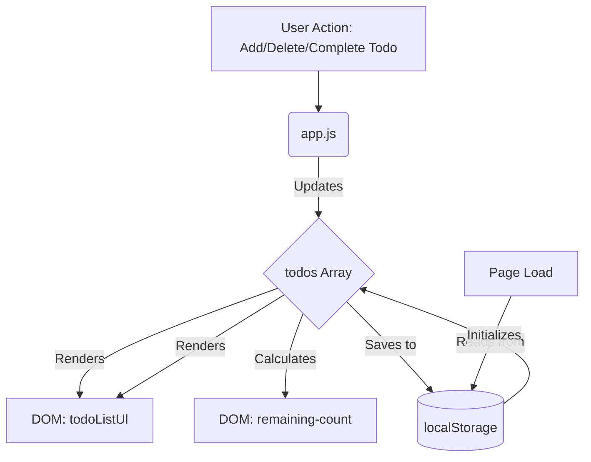

# Todo App

A simple, responsive Todo List application built with HTML, CSS, and Vanilla JavaScript. It allows users to manage their daily tasks efficiently, and persists the data in the browser's `localStorage` so you don't lose your tasks when refreshing the page.

## 🔗 Live Demo
[View Live Demo Here](https://vishwakarmayash.github.io/TodoApp/) 

## ✨ Features
- Add new tasks
- Mark tasks as completed or active
- Delete individual tasks
- Clear all completed tasks at once
- Persists tasks using `localStorage`
- Responsive design for mobile and desktop

## 🏗️ Architecture & Data Flow Diagram

Here is a simple diagram explaining how the application works:

## 🚀 How to Run Locally

1. Clone this repository or download the files.
2. Open the directory containing the files.
3. Simply double-click `index.html` to open it in your default web browser.

## 🛠️ Built With

- **HTML5** for structure
- **CSS3** for styling (Responsive, Flexbox)
- **Vanilla JavaScript** for DOM manipulation and logic
- **localStorage API** for saving state

